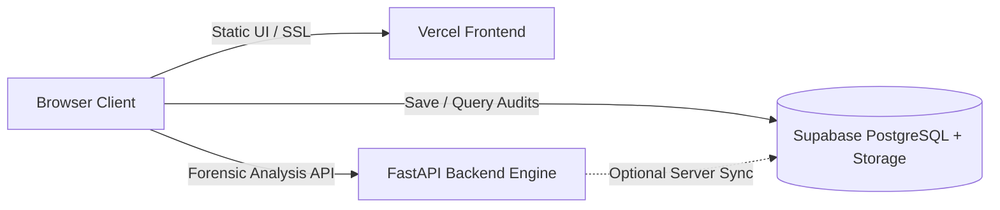

# 🚀 DocuVerify — Deployment Guide (Vercel & Supabase)

This document provides a step-by-step guide to deploying **DocuVerify** using **Vercel** for frontend hosting and **Supabase** for database records & audit history.

---

## Architecture Overview



---

## Step 1: Set up Supabase (Free Database & Vault)

1. Go to [supabase.com](https://supabase.com) and create a **New Project**.
2. Once your database is provisioned:
   - Navigate to **SQL Editor** in the left sidebar.
   - Click **New Query**.
   - Copy and paste the entire contents of [`supabase_schema.sql`](file:///c:/Users/viji/Documents/doc%20verify/supabase_schema.sql).
   - Click **Run**. This will create the `verification_reports` table, indices, storage bucket `forensic-vault`, and Row Level Security (RLS) policies.
3. Obtain your Project Credentials:
   - Navigate to **Project Settings** (gear icon) &rarr; **API**.
   - Copy **Project URL** (e.g., `https://abcdefghijkl.supabase.co`).
   - Copy **anon / public key** (`eyJhbGciOi...`).

---

## Step 2: Deploy Frontend on Vercel

### Option A: Deploy via GitHub (Recommended)
1. Push your project to a GitHub repository:
   ```bash
   git init
   git add .
   git commit -m "Deploy DocuVerify with Vercel and Supabase"
   git remote add origin https://github.com/YOUR_USERNAME/docuverify.git
   git push -u origin main
   ```
2. Log into [vercel.com](https://vercel.com).
3. Click **Add New...** &rarr; **Project**.
4. Import your `docuverify` repository.
5. In **Build and Output Settings**:
   - Framework Preset: **Other**
   - Root Directory: `./`
6. Click **Deploy**. Vercel will automatically process [`vercel.json`](file:///c:/Users/viji/Documents/doc%20verify/vercel.json) and generate your live production URL (e.g. `https://docuverify.vercel.app`).

### Option B: Deploy via Vercel CLI
If Node.js and Vercel CLI are installed:
```bash
npm i -g vercel
vercel deploy --prod
```

---

## Step 3: Connect Frontend to Backend & Supabase

1. Open your live Vercel website (e.g., `https://docuverify.vercel.app`).
2. Click **⚙ Settings** in the top navigation bar.
3. Enter your:
   - **Backend Engine API URL**:
     - For local development: `http://127.0.0.1:8000`
     - For remote deployment: Your hosted backend URL (Render, Railway, or live tunnel)
   - **Supabase Project URL**: `https://xxxxxxxxxxxx.supabase.co`
   - **Supabase Public Anon Key**: `eyJhbGciOi...`
4. Click **Test Connection** to verify database connectivity.
5. Click **Save & Apply**.

Your status badge will immediately turn green (**Supabase: Connected**)!

---

## Step 4: Host the Forensic Backend (Python + OpenCV Engine)

Because DocuVerify uses OpenCV (`cv2`), Tesseract OCR, and C-extensions for digital forensics, host the backend service using one of the following free options:

### Option A: Free Cloud Hosting on Render / Railway
1. **Render**:
   - Create a **New Web Service** connected to your repo.
   - Root Directory: `backend`
   - Environment: `Python 3`
   - Build Command: `pip install -r ../requirements.txt`
   - Start Command: `uvicorn main:app --host 0.0.0.0 --port $PORT`
2. Once deployed, copy your Render URL (e.g., `https://docuverify-api.onrender.com`) and paste it into the **⚙ Settings** modal on your Vercel site.

### Option B: Live Public Tunnel (Instant Online Access from Local Machine)
If running the backend locally and sharing it online:
```bash
# Using Cloudflare Tunnel (no account required)
cloudflared tunnel --url http://127.0.0.1:8000

# OR using Ngrok
ngrok http 8000
```
Copy the generated `https://...trycloudflare.com` or `https://...ngrok-free.app` URL and paste it into **⚙ Settings** &rarr; **Backend Engine API URL**.

---

## Verification & Features

- ✅ **Automatic Cloud Persistence**: Every uploaded document analyzed is automatically saved with all 6 forensic scores, highlighted anomaly coordinates, and verdicts into Supabase.
- ✅ **Audit Vault**: Click **Audit Vault** in the navbar anytime to view and reload past forensic verification records.
- ✅ **Decoupled Architecture**: Vercel delivers ultrafast static edge delivery, Supabase handles PostgreSQL queries & security, and FastAPI executes deep forensic processing.
